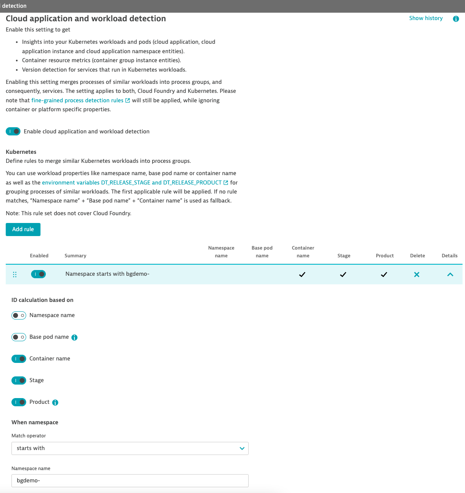
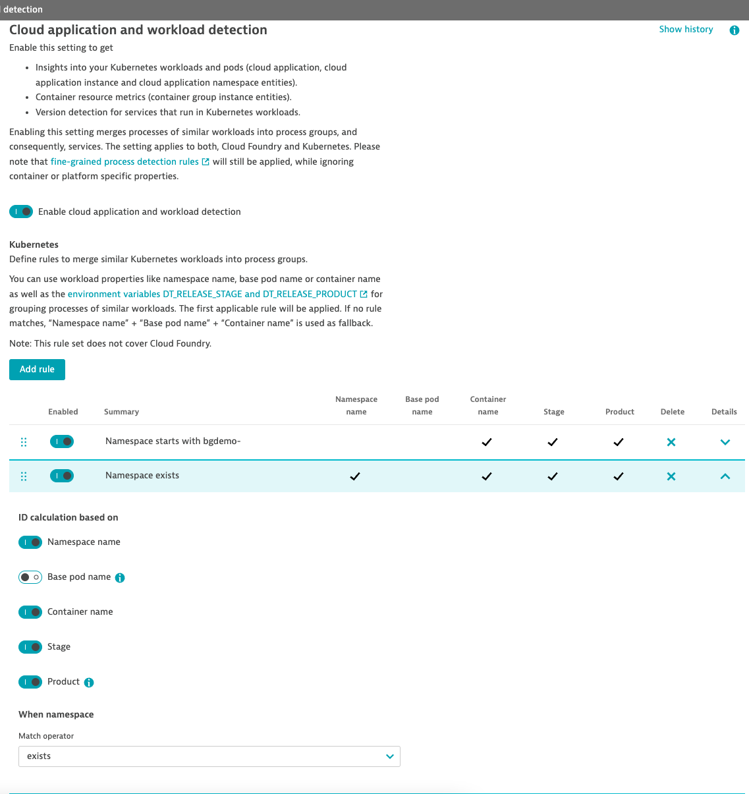

# Release Strategies

This folder contains 2 Kubernetes demo samples showcasing how a blue/green deployment and a canary deployment can be properly configured for observability purposes in Dynatrace. The goal is to get consistent and merged services within Dynatrace which allow you to analyse important service metrics (golden signals) by service version.

Prerequisites:
- K8s cluster up and running (e.g. GKE in a version supported by Dynatrace (Operator))
- Dynatrace Operator with AG and OneAgents rolled out in classic full-stack mode
- Istio (>=1.13) installed in this K8s cluster (e.g. default profile) 

## Blue/Green Deployment

Scenario:
Google's hipster-shop will be deployed in separate blue/green namespaces. After a new version has been tested, released and deployed, traffic will be shifted accordingly. For this purpose, the hipster-shop loadbalancer will be deployed in the default namespace and slighly misused to simulate load balancing. 

To start with, let's assume that the bgdemo-blue namespace shall host the current production version (0.3.6) while the green namespace contains the preproduction version (0.4.0) of the next release. As a next step, green will get the new production version and traffic is shifted from blue to green. 


1. Create Namespaces
```
kubectl create ns bgdemo-blue
kubectl create ns bgdemo-green
kubectl label ns bgdemo-green istio-injection=enabled
```

2. Dynatrace Product: Add Kubernetes rule to your Cloud Application and Workload Detection Settings
This rule will make sure that workloads are merged across the two namespaces into the same process group and hence, Dynatrace Service. 
<p align="center">

</p>

3. Deploy prod hipster-shop to namespace bgdemo-blue and deploy loadgenerator to namespace default
```
kubectl apply -f blue-green/blue/ -n bgdemo-blue
kubectl apply -f blue-green/loadgen-blue.yaml
```

4. Deploy pre-prod hipster-shop to namespace bgdemo-green and generate some additional load towards this pre-prod environment
```
kubectl apply -f blue-green/green-preprod/ -n bgdemo-green
kubectl apply -f blue-green/loadgen-preprod-green.yaml
```
5. Review resulting services within Dynatrace
Dynatrace will detect and display different services for each namespace, since STAGE is included in the rule we have added in STEP 2 but differs between blue and green namespace (PROD vs. PREPROD)

6. Release and Deploy v0.4.0 as new production version
```
kubectl delete -f blue-green/loadgen-preprod-green.yaml
kubectl apply -f blue-green/green/ -n bgdemo-green
kubectl apply -f blue-green/loadgen-green.yaml
```

7. Review and analyse what has changed within Dynatrace
- Services will now be merged (blue/green) since STAGE is PROD for all of them
- Traffic is shifted from blue to green namespace
- Response time increased after deployment (since Istio was used for injection delay at paymentservice and productcatalogservice)
- Use Multi-Dimensional-Analysis (metric: Response-time) and split by dimension ApplicationReleaseVersion 


## Canary Deployment

Scenario:
Google's hipster-shop will be deployed in a namespace hipster-shop. A new version of microservices paymentservice and checkoutservice are available. Thus, a canary deployment will be triggered and 20% of the traffic shifted to the new version (via Istio). Dynatrace will show that error rate increased after the deployment and that this is tied to the new version. 

1. Create Namespace
```
kubectl create ns hipster-shop
kubectl label ns hipster-shop istio-injection=enabled
```

2. Dynatrace Product: Add (default) Kubernetes rule to your Cloud Application and Workload Detection Settings
This rule will make sure that workloads are merged based on Namespace, container name, PRODUCT and STAGE. As a default rule (Namespace exists), it will be executed for any namespace given there is no applicable rule with a higher priority order. 
<p align="center">

</p>

3. Deploy prod hipster-shop 
This deployment already includes the new version (0.4.0) of deployments (checkoutdeploy-canary-demo & paymentdeploy-canary-demo). However, traffic is 100% routed to version 0.3.6
```
kubectl apply -f canary/hs-canary-all-deployments.yaml -n hipster-shop
kubectl apply -f canary/hs-canary-all-services.yaml -n hipster-shop
kubectl apply -f canary/hs-canary-istio-basic-setup.yaml -n hipster-shop
```

4. Review resulting services within Dynatrace
Dynatrace will detect and merge service already (just 1 Checkoutservice/Paymentservice). However, just 1 service instance (0.3.6) will recevive traffic, respectively.

5. Shift traffic to canaries
```
k apply -f canary/hs-canary-istio-shift-traffic.yaml -n hipster-shop
```

7. Review and analyse what has changed within Dynatrace
- No changes to service / process groups since they have already been merged
- 2 service instances will receive traffic
- Error rate will increase for checkoutservice 
- Use Multi-Dimensional-Analysis (metric: error rate) and split by dimension ApplicationReleaseVersion to verify that errors are caused by version 0.4.0

_Hint: Percentage of failed calls can be modified with Environment variable WRONG_CARD_TYPE_FAILURE_RATE of deployment paymentdeploy-canary-demo_
